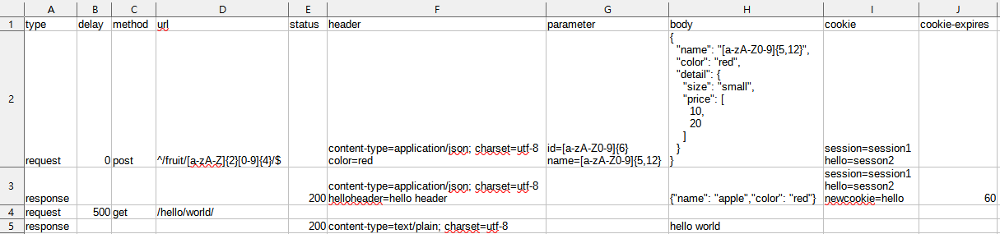
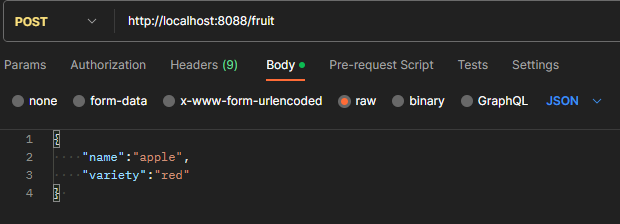

# 介紹
* 特色1: 藉由 csv檔案內的設定可以動態產生 API, API請求會回傳事先設定好的內容, 不需要修改程式碼, 並且提供 API可以更新 csv檔案. 可以用於 API規劃提供時期的替代方案.

* 特色2: 可以直接對指定的 SQL Server進行 CRUD, 藉由 Rest API操作資料庫, 回傳內容以 JSON格式回傳.

# 特色1 動態API

## 使用方法
先設定 `public/sample.csv`, 設定 API後即可開啟程式使用.

## 更新 csv檔案
* 方法1: 直接將 csv檔案放置到 public目錄.
* 方法2: 透過網頁打開 localhost:8080可以開啟上傳 csv檔案的畫面.

## csv檔案設定
* csv檔案都存放在 public目錄. 
* 使用 csv格式儲存設定 api.
* 可以有多份 csv檔案

## 備註

 `GET /list`這個 API可以查詢目前有哪些 csv檔案
> 例如: http://localhost:8080/list

 `GET /download`這個 API可以下載指定 csv檔案
> 例如:  http://localhost:8080/download?filename=sample.csv

## csv檔案內容範例



# 特色2 Rest API操作 SQL Server

## 使用方法
`resources/application.properties` 設定連接的 SQL Server, 設定後即可開啟程式使用, 使用時可以搭配 Postman工具.

## 有效的 method
目前提供5種可用的 mothod, 分別是:GET、POST、PUT、PATCH、DELETE.

## 分頁查詢
由於 GET 情況時可能會有多筆紀錄, 因此在做查詢時可搭配使用分頁
使用 limit和 offset參數.

* limit: 輸出 n筆
* offset: 跳過 n筆資料

``` 
範例 
查詢 fruit資料表並且輸出 2筆紀錄跳過0筆紀錄

GET http://localhost:8088/fruit?limit=2&offset=0
```

## 條件查詢
查詢指定資料表內符合條件的資料, 可和 limit、offset同時使用.

``` 
範例 
查詢 fruit資料表並且name欄位名稱符合 apple的紀錄

GET http://localhost:8088/fruit?name=apple
```
## 範例
範例會進行操作 `fruit`資料表, 並且新增一筆紀錄, 紀錄的欄位資料分別是 apple和 red.

